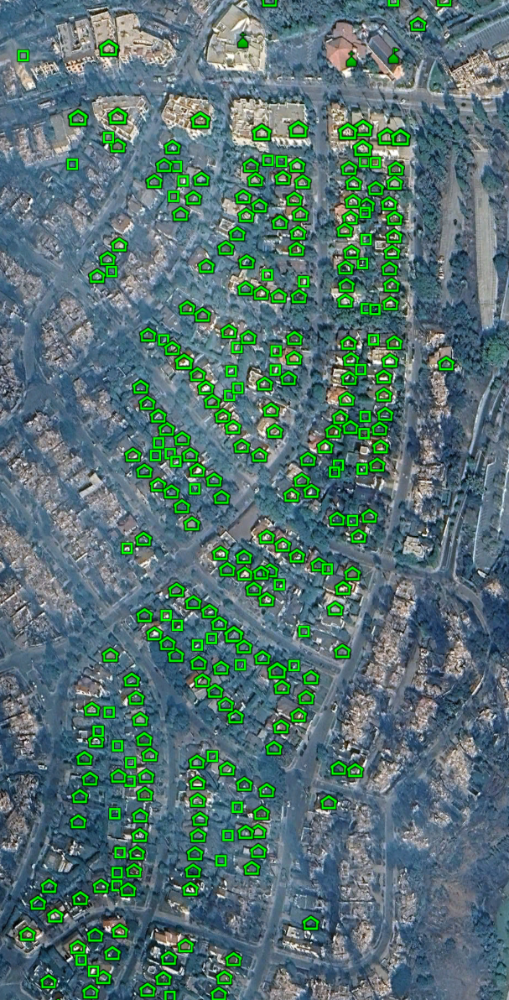
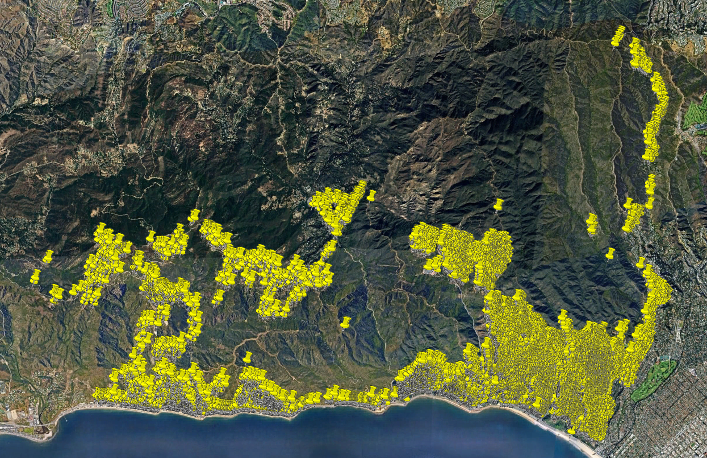
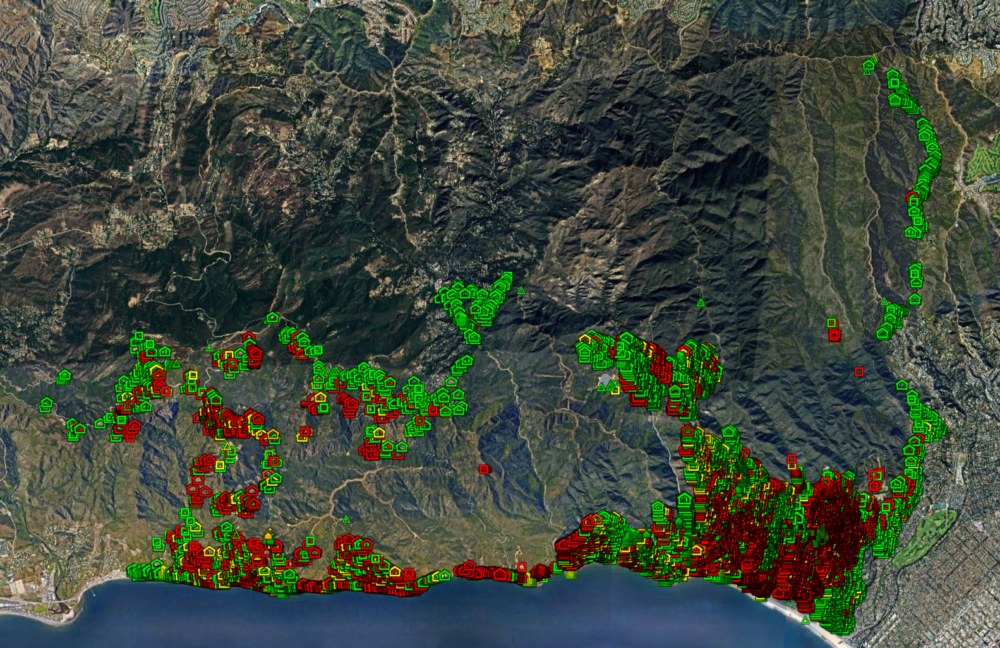
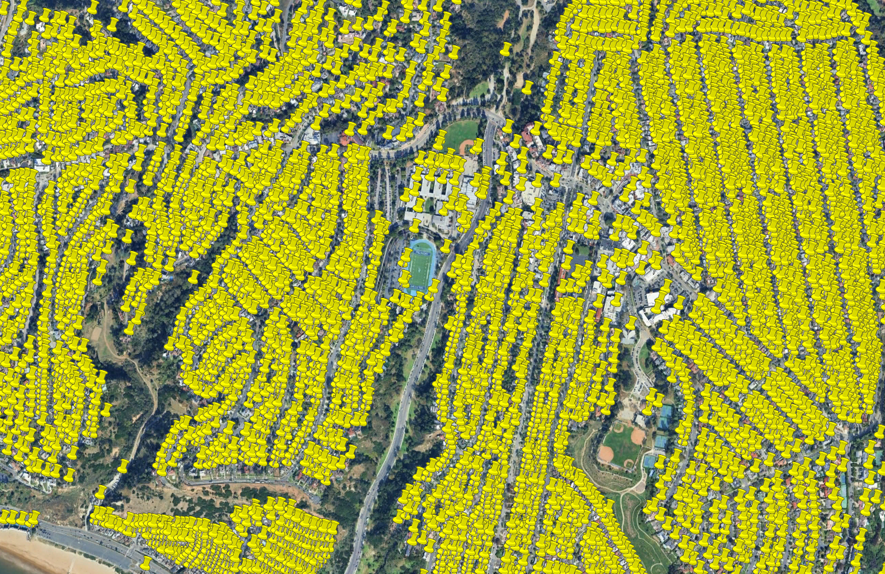
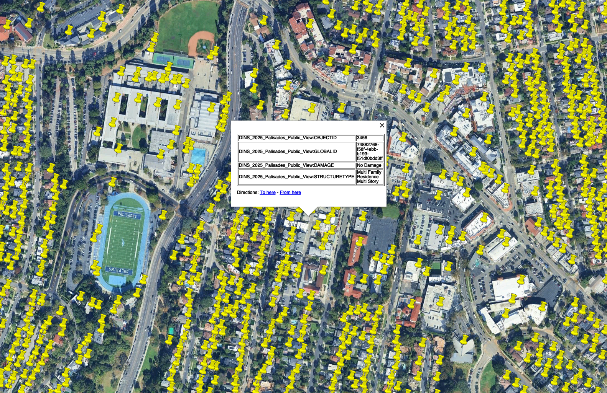
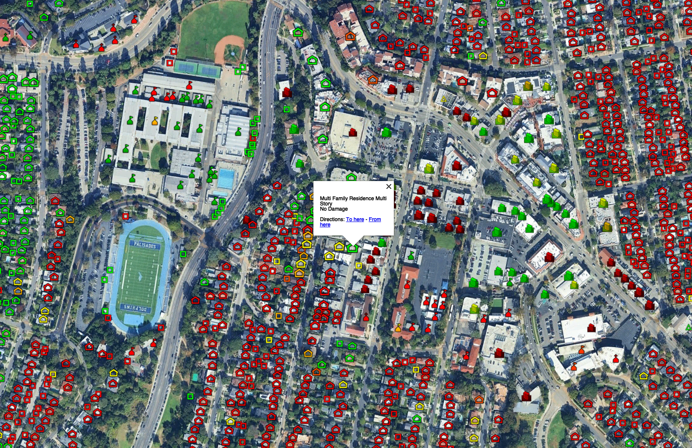
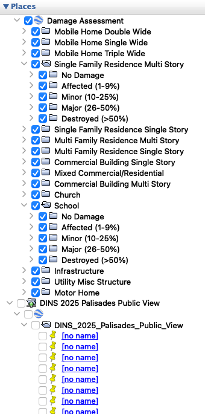
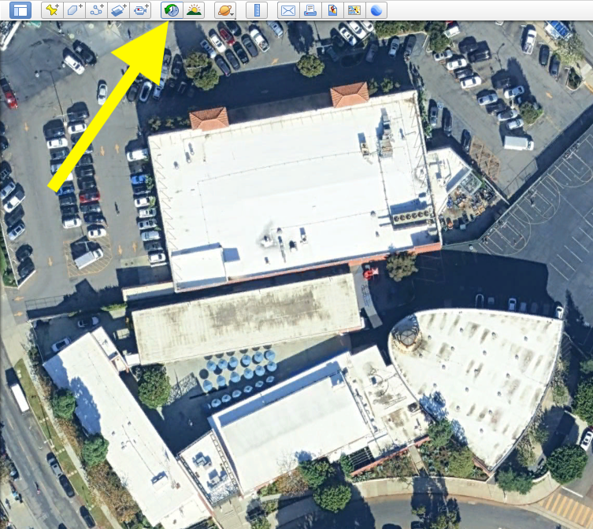
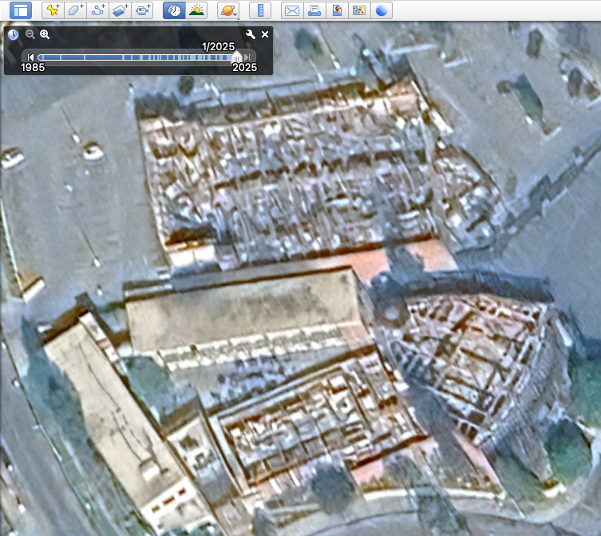

# 2025 Palisades Fire - Damage Assessment Data View Converter

This script converts CAL FIRE's Damage Inspection (DINS) data for the 2025 Palisades Fire from GeoJSON format to a color-coded KML file for visualization in Google Earth or Google Earth Pro. This script changes the visual style of the original data from CAL FIRE by grouping the structures by type and damage level, using different icons for different structure types, and color coding the icons to indicate the amount of damage.

# Notice: If you're here to cast blame, or spread misinformation or conspiracy theories, or act in any way that could be considered unhelpful, disrespectful, illegal, or immoral - please leave. This is not the place for that, nor is any other place.

# Disclaimer
I'm just some random person who has no experience with GIS or fire science. I'm not a fire scientist or a fire code expert. I'm just a software hobbiest engineer who is interested in the fire and trying to learn more about it. Please do not take anything I say as proof or fact or explanation of anything!

# Intended Purpose
I wanted to see the damage assesments in a more visually obvious way than the original KML file. I also wanted to see if viewing the data in this way would make it easier to discover possible lessons to learn about how the fire spread and how that might useful to inform future rebuilding efforts and perhaps fire building codes.

## For Example
When viewing only the undamaged structures in this image below, knowing that the structures around it were mostly destroyed, it seems like there might have been something acting in a protective way to prevent the fire from spreading to this area. I see that at the top of the image there is a row of multi-story commercial buildings that were stucco clad and taller than most homes south of it (down wind at the time of the fire).




# Comparison of Original KML and Improved KML
### Overall Area



### Zoomed In



### Popups



### List View (original is "DINS 2025 Palisades Public View" towards the bottom)


## Helpful Google Earth Pro Feature
Using the "Historical Imagery" option in Google Earth Pro you can toggle between the most recent imagery before and after the fire. As of January 26, 2025, the most recent imagery is not very good quality, but it's sufficient for getting a sense of the damage.




## Data Source

The source GeoJSON data comes from [CAL FIRE's public dataset](https://data.ca.gov/dataset/dins-2025-palisades-public-view) which provides damage inspection information for structures affected by the Palisades Fire. It appears to be updated during the day at irregular times and will likley be update less and less frequently as all structures finish being inspected.

## Features

- Converts structure damage data to color-coded placemarks:
  - No Damage: Green
  - Affected (1-9%): Yellow
  - Minor (10-25%): Yellow-Orange
  - Major (26-50%): Orange
  - Destroyed (>50%): Red

- Organizes structures by type and damage level in nested folders
- Uses different icons for structure types:
  - Church
  - Commercial Building Multi Story
  - Commercial Building Single Story
  - Infrastructure
  - Mixed Commercial/Residential
  - Mobile Home Double Wide
  - Mobile Home Single Wide
  - Mobile Home Triple Wide
  - Motor Home
  - Multi Family Residence Multi Story
  - Multi Family Residence Single Story
  - School
  - Single Family Residence Multi Story
  - Single Family Residence Single Story
  - Utility Misc Structure

# How to Use
## Using the KML file directly in Google Earth Pro (Recommended)

To access the KML file directly in Google Earth Pro without having to run this script or download anything, you can use a network link:

1. In Google Earth Pro, select "Add" → "Network Link"
2. Set the Link to: `https://raw.githubusercontent.com/some-rando/Palisades-Fire-2025-KML/main/damage_assessments.kml`
3. Set "Refresh" settings as desired, probably time-based refresh, periodically. More frequently than every 4 hours won't be useful because the data is only updated every 4 hours.

The KML file is automatically updated at 6am, 10am, 2pm, and 6pm through GitHub Actions, pulling the latest data from CAL FIRE's public dataset.


## Using the script to generate a KML file

1. Clone the repository
```bash
git clone https://github.com/some-rando/Palisades-Fire-2025-KML.git
```

2. Run the script:
```bash
python process_geojson_to_kml.py
```

## Licenses

This source data for this project uses data from CAL FIRE which has its Rights listed as "No restrictions on public use".

This script is licensed under the MIT License - see the LICENSE file for details.
